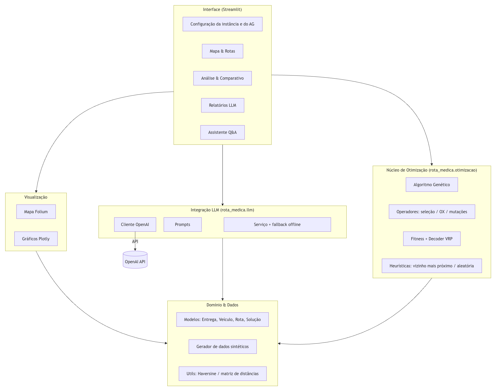
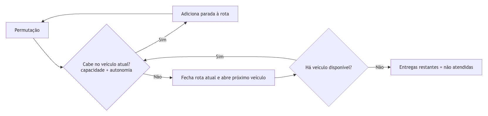
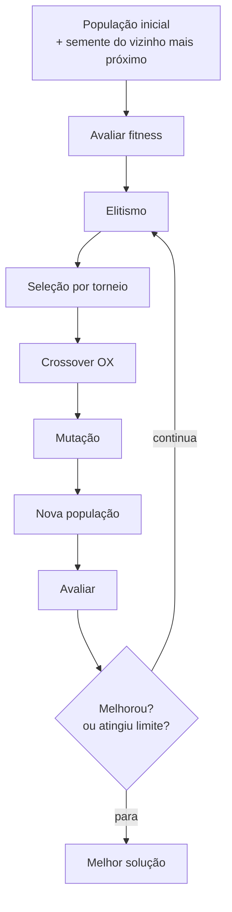
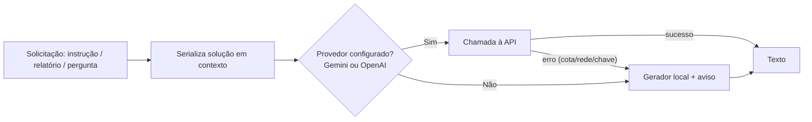
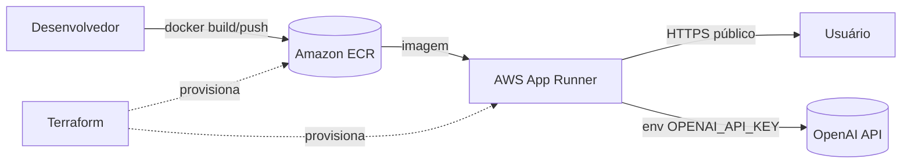

# Projeto 2 — Otimização de Rotas para Distribuição de Medicamentos e Insumos

**Tech Challenge — Fase 2 | FIAP — IA para DEVS**

Sistema que resolve o problema de roteamento de veículos (VRP — uma
generalização do "caixeiro viajante") para a logística de um hospital, usando **Algoritmos Genéticos** para otimizar as rotas e uma
**LLM (OpenAI)** para gerar instruções, relatórios e responder perguntas em
linguagem natural.


## Sumário

1. [Visão geral da solução](#1-visão-geral-da-solução)
2. [Como executar](#2-como-executar)
3. [Arquitetura](#3-arquitetura)
4. [Modelagem do problema (VRP)](#4-modelagem-do-problema-vrp)
5. [Algoritmo Genético](#5-algoritmo-genético)
6. [Restrições realistas atendidas](#6-restrições-realistas-atendidas)
7. [Integração com LLM](#7-integração-com-llm)
8. [Comparativo de desempenho](#8-comparativo-de-desempenho)
9. [Visualizações](#9-visualizações)
10. [Testes automatizados](#10-testes-automatizados)
11. [Implantação em nuvem (IaC)](#11-implantação-em-nuvem-iac)
12. [Mapeamento dos requisitos do enunciado](#12-mapeamento-dos-requisitos-do-enunciado)
13. [Roteiro sugerido para o vídeo (até 15 min)](#13-roteiro-sugerido-para-o-vídeo-até-15-min)
14. [Checklist de entregáveis](#14-checklist-de-entregáveis)

---

## 1. Visão geral da solução

O hospital precisa distribuir medicamentos e insumos entre suas
unidades e para atendimento domiciliar, com uma frota limitada. O sistema:

- Gera (ou recebe) um conjunto de **entregas** com localização, demanda (kg) e
  **prioridade** (Crítico, Alto, Normal, Baixo);
- Otimiza as rotas com um **Algoritmo Genético** que respeita capacidade de
  carga, autonomia dos veículos e múltiplos veículos (VRP);
- Exibe as rotas em um **mapa interativo**;
- Usa uma **LLM** para gerar instruções ao motorista, relatórios de eficiência,
  sugestões de melhoria e um **assistente de perguntas e respostas**;
- Compara o AG com heurísticas de referência (vizinho mais próximo e aleatória).

A interface principal é um **app web em Streamlit**.

---

## 2. Como executar

### Pré-requisitos
- Python 3.10 a 3.12
- (Opcional) Chave da OpenAI para os recursos de LLM. Sem a chave, o sistema
  continua funcionando com um **gerador de textos local (fallback)**.

### Opção A — venv + pip (mais simples)

```bash
python3 -m venv .venv
source .venv/bin/activate          # Windows: .venv\Scripts\activate
pip install -r requirements.txt

cp .env.example .env               # edite e coloque sua OPENAI_API_KEY
streamlit run rota_medica/app/streamlit_app.py
```

### Opção B — Poetry

```bash
poetry install
cp .env.example .env
poetry run streamlit run rota_medica/app/streamlit_app.py
```

### Opção C — Docker

```bash
docker compose up --build
# App disponível em http://localhost:8501
```

### Linha de comando (demonstração rápida, sem interface)

```bash
python -m rota_medica.cli --entregas 18 --veiculos 3 --geracoes 300 \
    --comparar --relatorio --mapa outputs/rotas.html
```

### Variáveis de ambiente (`.env`)

O sistema suporta **dois provedores de LLM** (Google Gemini ou OpenAI) e detecta
automaticamente qual usar pela chave presente. Sem nenhuma chave, usa o gerador
local (fallback).

| Variável | Descrição | Padrão |
|---|---|---|
| `LLM_PROVIDER` | `gemini` ou `openai` (vazio = autodetecção) | *(auto)* |
| `GEMINI_API_KEY` | Chave do Google Gemini (camada **gratuita**) | *(vazio)* |
| `GEMINI_MODEL` | Modelo do Gemini | `gemini-2.0-flash` |
| `OPENAI_API_KEY` | Chave da OpenAI (requer créditos pagos) | *(vazio)* |
| `OPENAI_MODEL` | Modelo da OpenAI | `gpt-4o-mini` |
| `SEED` | Semente para dados reprodutíveis | `42` |

> **Gemini (gratuito):** gere a chave em https://aistudio.google.com/app/apikey,
> adicione `GEMINI_API_KEY` ao `.env` e o sistema já a usa (o Gemini tem
> prioridade na autodetecção). A OpenAI é opcional e exige créditos.

---

## 3. Arquitetura

### 3.1 Componentes



---

## 4. Modelagem do problema (VRP)

O problema é modelado como um **Vehicle Routing Problem (VRP)** com restrições:

- **Depósito**: hospital central (ponto de partida e retorno de toda rota).
- **Entregas**: cada uma com coordenada geográfica, demanda em kg, prioridade,
  tempo de serviço e tipo de carga.
- **Frota heterogênea**: veículos com capacidade (kg), autonomia (km),
  velocidade média e custo por km diferentes (van refrigerada, furgão, moto,
  carro utilitário).

As **distâncias** são calculadas pela fórmula de **Haversine** (distância
geodésica em km entre coordenadas), montando uma matriz de distâncias em que o
índice `0` é sempre o depósito.

---

## 5. Algoritmo Genético

### 5.1 Representação genética (cromossomo)

Um indivíduo é uma **permutação dos índices das entregas** (`0 … n-1`),
interpretada como um *giant tour*. Um procedimento de **split** percorre a
permutação e distribui as entregas entre os veículos, respeitando capacidade e
autonomia. Essa representação é elegante porque:

- é sempre válida (nenhuma entrega duplicada ou faltante);
- serve tanto para **TSP** (1 veículo) quanto para **VRP** (vários veículos);
- os operadores clássicos de permutação (OX, inversão) se aplicam diretamente.

### 5.2 Decodificação (split VRP)



### 5.3 Função de fitness (custo a minimizar)

A função combina múltiplos objetivos:

```
custo = peso_distancia   × distância_total
      + peso_prioridade  × Σ (urgência × latência_da_entrega)
      + peso_veiculo     × nº_de_veículos_usados
      + peso_nao_atendida × Σ (urgência das entregas não atendidas)
```

- **Distância total**: objetivo principal (menos km = menos custo/tempo).
- **Prioridade**: entregas críticas devem ser atendidas **cedo e perto**. Usa a
  *latência* (distância acumulada até a parada) ponderada pela urgência.
- **Nº de veículos**: custo fixo por veículo incentiva consolidar rotas.
- **Não atendidas**: penalidade muito alta, agravada pela prioridade, para que
  o AG só deixe algo sem atender quando for realmente inviável.

### 5.4 Operadores genéticos

| Operador | Técnica | Motivo |
|---|---|---|
| Seleção | **Torneio** (k configurável) | Pressão seletiva ajustável e simples |
| Crossover | **Order Crossover (OX)** | Preserva a validade da permutação |
| Mutação | **Troca / Inserção / Inversão (2-opt)** | Diversidade + refino local |
| Elitismo | N melhores passam intactos | Não perde a melhor solução |

Recursos adicionais:
- **GA híbrido**: a população inicial é semeada com a solução do **vizinho mais
  próximo**, garantindo que o AG nunca seja pior que essa heurística.
- **Early stopping**: para após `paciência` gerações sem melhora.
- **Reprodutibilidade**: mesma `seed` → mesmo resultado.

### 5.5 Fluxo evolutivo



---

## 6. Restrições realistas atendidas

| Restrição | Como é tratada |
|---|---|
| **Prioridades** (crítico × regular) | Peso de urgência na fitness (crítico=8, alto=4, normal=2, baixo=1) e desconto na heurística |
| **Capacidade de carga** | O split só adiciona uma parada se `carga + demanda ≤ capacidade` do veículo |
| **Autonomia** | Só adiciona a parada se `distância acumulada + ida + retorno ≤ autonomia` |
| **Múltiplos veículos (VRP)** | Frota heterogênea; o split abre um novo veículo quando o atual "enche" |
| **Frota heterogênea** | Cada veículo tem capacidade, autonomia, velocidade e custo/km próprios |
| **Custo operacional (R$)** | Custo por km por veículo, agregado por rota e total |
| **Tempo estimado** | Tempo de deslocamento (distância/velocidade) + tempo de serviço por parada |
| **Entregas inviáveis** | Marcadas como "não atendidas" e sinalizadas no mapa e nos relatórios |

---

## 7. Integração com LLM

### 7.1 Usos da LLM
1. **Instruções para o motorista**: checklist de saída, sequência de paradas com
   cuidados por prioridade (ex.: cadeia de frio, itens críticos) e conduta em
   imprevistos.
2. **Relatórios de eficiência** (diário/semanal): resumo executivo, indicadores,
   análise por rota, riscos e conclusão.
3. **Sugestões de melhoria**: recomendações priorizadas com impacto e esforço.
4. **Assistente Q&A**: responde perguntas em linguagem natural usando apenas os
   dados das rotas (evita alucinação).

### 7.2 Engenharia de prompts
- **System prompt** define o papel (especialista em logística hospitalar), o
  idioma (pt-BR) e cuidados de saúde (cadeia de frio, lote/validade, segurança).
- A instrução pede explicitamente que a resposta se baseie **apenas** nos dados
  fornecidos e que sinalize quando a informação não existir.
- A solução é serializada em um **contexto textual enxuto** (economia de tokens)
  antes de ser enviada.

### 7.3 Multi-provedor e fallback resiliente
O `ClienteLLM` é **agnóstico de provedor**: funciona com **Google Gemini**
(camada gratuita) ou **OpenAI**, escolhidos por `LLM_PROVIDER` ou por
autodetecção da chave presente. Se nenhuma chave estiver configurada — **ou se a
chamada à API falhar** (cota esgotada, chave inválida, rede) — o `ServicoLLM`
degrada automaticamente para geradores locais determinísticos, exibindo um aviso
com o motivo. Isso garante que a interface **nunca quebre** e que a demonstração
e os testes rodem sem depender de rede ou chave.



---

## 8. Comparativo de desempenho

O sistema compara o AG com duas referências na **mesma instância**:

- **Aleatória**: permutação embaralhada (baseline ingênuo).
- **Vizinho mais próximo**: heurística gulosa com desconto por prioridade.
- **Algoritmo Genético**: nossa proposta.

### Exemplo (18 entregas, 3 veículos, seed 42, 300 gerações)

| Abordagem | Custo (fitness) | Distância (km) | Custo (R$) | Veículos | Não atendidas |
|---|---:|---:|---:|---:|---:|
| Aleatória | 882,8 | 171,3 | 507,9 | 2 | 0 |
| Vizinho mais próximo | 308,5 | 82,5 | 240,1 | 2 | 0 |
| **Algoritmo Genético** | **290,5** | **78,0** | **226,6** | 2 | 0 |

**Leitura**: o AG reduz a distância em ~54% frente à aleatória e supera a
heurística gulosa tanto em distância quanto no custo global (fitness), que
também considera a prioridade das entregas críticas. Os números são
reprodutíveis via `python -m rota_medica.cli --comparar` (podem variar conforme
a instância/seed). A aba **"Análise & Comparativo"** do app reproduz essa tabela
e o gráfico de barras.

---

## 9. Visualizações

- **Mapa interativo (Folium)**: depósito destacado; uma cor por rota/veículo;
  marcadores por prioridade; *popups* com detalhes da parada; entregas não
  atendidas sinalizadas; controle de camadas para ligar/desligar rotas.
- **Gráfico de convergência (Plotly)**: melhor custo × custo médio por geração.
- **Gráfico de ocupação**: percentual de uso da capacidade de cada veículo.
- **Gráfico comparativo**: distância e custo por abordagem.

---

## 10. Testes automatizados

Suíte em `pytest` cobrindo: utilitários geométricos, geração de dados,
operadores genéticos (validade das permutações), decoder/fitness (capacidade,
autonomia, prioridade, não atendidas), o motor do AG (melhora vs. baseline,
reprodutibilidade, convergência monotônica) e o serviço de LLM (modo offline).

```bash
pip install -r requirements-dev.txt
pytest -q                 # 26 testes
pytest --cov=rota_medica  # com cobertura
```

---

## 11. Implantação em nuvem (IaC)

Arquitetura de deploy escolhida: **Amazon ECR** (registro da imagem) +
**AWS App Runner** (execução do container web, com HTTPS e escala gerenciada).



Passos:

```bash
cd infra
cp terraform.tfvars.example terraform.tfvars   # preencha a OPENAI_API_KEY
terraform init
terraform apply            # cria ECR + App Runner + IAM role
./deploy.sh                # build + push da imagem (App Runner faz auto-deploy)
terraform output app_url   # URL pública do app
```

Arquivos: `infra/versions.tf`, `infra/variables.tf`, `infra/main.tf`,
`infra/outputs.tf`, `infra/deploy.sh`.

---

## 12. Mapeamento dos requisitos do enunciado

| Requisito do enunciado | Onde está atendido |
|---|---|
| Representação genética adequada para rotas | `otimizacao/fitness.py` (permutação + split), seção 5.1 |
| Operadores especializados (seleção, crossover, mutação) | `otimizacao/operadores.py`, seção 5.4 |
| Função fitness com distância, prioridade e restrições | `otimizacao/fitness.py` (`_custo`), seção 5.3 |
| Prioridades diferentes de entrega | `dominio.Prioridade`, pesos na fitness |
| Capacidade limitada de carga | Decoder `fitness.decodificar` |
| Autonomia limitada dos veículos | Decoder `fitness.decodificar` |
| Múltiplos veículos (VRP) | Frota + split multi-veículo |
| Outras restrições interessantes | Frota heterogênea, custo R$, tempo, tempo de serviço |
| Visualização das rotas em mapa | `visualizacao.criar_mapa` (Folium), app |
| LLM: instruções para motoristas | `llm/servico.instrucoes_motorista` |
| LLM: relatórios diários/semanais | `llm/servico.relatorio` |
| LLM: sugestões de melhoria | `llm/servico.sugestoes` |
| Prompts eficientes | `llm/prompts.py` + `llm/contexto.py` |
| Perguntas em linguagem natural | `llm/servico.responder` + aba Assistente |
| Comparativo com outras abordagens | `otimizacao/heuristicas.comparar`, seção 8 |
| Projeto estruturado + ambiente virtual | Poetry/venv, `pyproject.toml`, `requirements*.txt` |
| Documentação + diagramas | Este arquivo (Mermaid) |
| Testes automatizados | `tests/` (26 testes) |
| IaC para nuvem | `infra/` (Terraform + App Runner) |

---

## 13. Roteiro sugerido para o vídeo (até 15 min)

1. **Abertura (0:00–1:00)** — Contexto: logística hospitalar, o problema do
   "caixeiro viajante médico" (VRP) e a proposta da solução.
2. **Arquitetura (1:00–2:30)** — Mostrar o diagrama (seção 3) e a estrutura de
   pastas; explicar a separação núcleo/LLM/visualização/app.
3. **Modelagem e AG (2:30–6:00)** — Representação por permutação, decoder com
   restrições (capacidade/autonomia/múltiplos veículos) e a função de fitness
   multiobjetivo (distância + prioridade). Mostrar `fitness.py` e `operadores.py`.
4. **Demonstração no app (6:00–10:00)** — Configurar instância na barra lateral,
   clicar em *Otimizar rotas*, mostrar o **mapa**, o detalhamento por rota, o
   gráfico de **convergência** e a **ocupação** dos veículos.
5. **Comparativo (10:00–11:30)** — Rodar AG × vizinho × aleatória e comentar os
   ganhos (tabela + gráfico).
6. **LLM (11:30–14:00)** — Gerar instruções do motorista, relatório de
   eficiência e usar o **assistente** para perguntas em linguagem natural.
7. **Nuvem e encerramento (14:00–15:00)** — Mostrar rapidamente o Terraform/App
   Runner e concluir com os resultados.

> Dica: rode com `OPENAI_API_KEY` configurada para demonstrar a LLM real; sem a
> chave, o app usa o gerador local (útil como plano B na gravação).

---

## 14. Checklist de entregáveis

- [x] Implementação do AG para roteamento (a partir de representação de TSP).
- [x] Estratégias para restrições (prioridade, capacidade, autonomia, múltiplos veículos).
- [x] Integração com LLM (instruções, relatórios, sugestões, Q&A).
- [x] Comparativo de desempenho com outras abordagens.
- [x] Visualizações e análises das rotas otimizadas.
- [x] Projeto estruturado com ambiente virtual (Poetry/venv).
- [x] Documentação detalhada com diagramas de arquitetura (este arquivo).
- [x] Testes automatizados.
- [x] (Opcional) Infraestrutura como código para nuvem.
- [ ] Vídeo de demonstração (até 15 min) — gravar e publicar no YouTube/Vimeo.
- [ ] Repositório Git com o código-fonte completo — inicializar e publicar.
